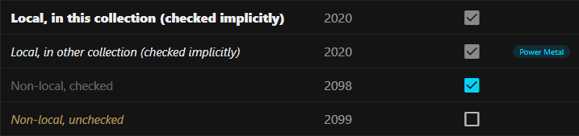

# Codex UI And Workflow Guide

This file owns practical UI and working-process rules for future Codex sessions in this repository.

## Operating Style

- Start with `git status --short`.
  The worktree may already contain user edits.
  Do not revert or rewrite unrelated files.
- Be direct about contradictions.
  If a requested behavior conflicts with an earlier rule or creates a weak UX, call it out before coding.
- For implementation requests, iterate through the task end to end: inspect, patch, build, run relevant checks, inspect the result, refine if needed.
- Keep changes scoped.
  Prefer small, coherent patches over broad rewrites.
- Use existing store/action/repository patterns before adding new abstractions.
- Avoid boilerplate.
  Add helpers only when they centralize real repeated behavior.
- For risky or destructive behavior, separate similar verbs precisely: `Remove` means unlink from the current context; `Delete` means delete from the library database.
- Do not use UI validation scripts to click destructive actions unless the user explicitly wants test data mutated.

## Session Collaboration And Handoff

Independent Codex sessions do not share hidden chat memory.
Use the current source-of-truth docs and the codebase as shared memory.

- Keep `AGENTS.md` for stable project rules and pointers only.
- Use `current-application.md` as the authoritative reference for current behavior, model, API semantics, provider behavior, scan behavior, settings behavior, and current constraints.
- Use `codex-ui-workflow-guide.md` for stable workflow and UI rules.
- Use `ideas.md` for unimplemented ideas only.
- Remove or shrink ideas from `ideas.md` when implementing or rejecting them.
- Treat `evolution-*.md` files as historical archaeology only.
- Consult evolution docs only when the current docs and code do not explain why an older decision exists.
- Do not put long session transcripts into `AGENTS.md`.
- Do not put chat chronology, session labels, suggested prompts, abandoned ideas, speculative alternatives, or commit archaeology into current docs.
- Do not create an evolution document for every session.
- Create a new evolution or design note only for a major decision that needs durable rationale beyond the current behavior reference.
- After a major decision is implemented, update `current-application.md` and leave the evolution doc as historical context.
- Before committing documentation, search the relevant code paths for behavior that could make the doc stale.
- When starting a separate session, give it a narrow ownership boundary, for example: "work only on album grid behavior" or "work only on settings layout".
- When two sessions work in parallel, use separate branches or worktrees and merge through normal Git review.
- At the end of a substantial session, update `current-application.md`, `ideas.md`, `README.md`, `AGENTS.md`, or this guide as appropriate for the behavior that actually changed.
- Temporary handoff files are allowed only for explicit parallel work and should be removed or folded into the source-of-truth docs before the work is finished.

Before merging parallel UI work, run one integration/review session that checks for conflicting assumptions, duplicated components, inconsistent state handling, and missing validation.

## UI Verification Workflow

Use `scripts/check-ui-layout.ps1` for any non-trivial UI change involving:

- workspace panes, pane resizing, or pane proportions
- scroll behavior or browser-level page height
- sticky headers or custom grid layout
- column resizing
- status bar location/history overlays
- row action visibility, dense table controls, or hover-only controls
- dialogs, dropdowns, or anchored popovers that can clip or overlap content

Recommended final UI check:

```bash
./gradlew build
java -jar build/quarkus-app/quarkus-run.jar
```

Then, in another shell:

```bash
powershell.exe -NoProfile -ExecutionPolicy Bypass \
  -File "$(wslpath -w scripts/check-ui-layout.ps1)" \
  -AppUrl "http://localhost:8795/"
```

Stop the packaged app afterward.
If Windows cannot reach WSL through localhost, pass the WSL IP instead:

```bash
APP_HOST="$(hostname -I | awk '{print $1}')"
powershell.exe -NoProfile -ExecutionPolicy Bypass \
  -File "$(wslpath -w scripts/check-ui-layout.ps1)" \
  -AppUrl "http://${APP_HOST}:8795/"
```

Treat the smoke check as failed when:

- the document height exceeds the browser viewport height
- expected collection, artist, album, or title rows are missing
- pane content has near-zero height while data exists
- pane bottoms, scrollbars, sticky headers, or row actions are visibly clipped
- screenshots show ghost columns or headers scrolling with content

For simple CSS-only changes, a frontend build may be enough, but if the visual result is ambiguous, run the smoke check.

## App Shell And Height Rules

- The app must not create a browser vertical scrollbar.
  The app shell owns the full viewport height.
- Panes, tables, lists, dialogs, dropdowns, and history views scroll internally only when their own content overflows.
- Status bar placement must not cause content jumps.
  It is always visible and shows idle state when no operation is active.
- If the status bar is configured at the bottom, popups/history should open above it.
  If it is at the top, they should open below it.

## Pane Layout Rules

- Runtime DB preference keys should be hierarchical and semantic:
  - screen-scoped pane/table state: `<screen>.<pane>.<thing>`
  - table column widths: `<screen>.<pane>.<column>`
  - coupled pane layouts: `<screen>.<layout-kind>.panes`
  - global UI state: `ui.<area>.<thing>`
  Do not add new flat keys such as `collections.columns.album`.
- Workspace screens use pane layouts, not marketing/landing layouts.
- Panes are resizable along the full vertical divider, not only at a corner.
- Pane layout is persisted as percentages, not pixels, so browser resize keeps proportions.
- Artist-centric and title-centric collection layouts are persisted independently.
  Current preference keys are `collections-screen.artist-layout.panes` and `collections-screen.title-layout.panes`.
- Pane resizing should behave like block movement:
  - resizing the collections pane moves the remaining panes as a block
  - resizing the middle pane moves the right pane as a block
  - rightmost pane absorbs remaining width
- Pane minimum widths must keep the pane title and required icon-only controls visible.
- Panes must not shrink so far that their title bar becomes unusable.
- Pane resizing must not mutate stored table column widths inside those panes.
  The rightmost/flexible table column visually absorbs pane width changes.
- Collection pane dropdowns should anchor under the triggering button.
  They should grow to available pane height, then scroll internally.
- Add-folder dropdowns should list folder names only and be only as wide as needed for the widest name, with the right edge aligned to the collection pane.

## Grid And Table Rules

- Workspace pane tables that need resizing or sticky headers use the custom CSS grid pattern, not Vuetify `v-table`.
- Workspace pane tables with unbounded or scan/provider-populated row counts must be virtualized.
- The Collections screen Artists, Albums, and Titles tables must all remain virtualized.
- Future library-management screens with full-library tables, including the main Artists screen, should use the same virtualized grid pattern before row counts become large.
- Use explicit pixel column widths from defaults/preferences.
- Column width defaults come from `application.properties`; user-adjusted widths are stored as DB preferences.
  Future screens should follow the same shape, for example `artists-screen.artists-pane.name`.
  Current collection-screen column keys include `collections-screen.artists-pane.name`, `collections-screen.albums-pane.name`, `collections-screen.albums-pane.release-date`, `collections-screen.albums-pane.checked`, `collections-screen.albums-pane.also-in`, `collections-screen.albums-pane.action`, `collections-screen.titles-pane.title`, `collections-screen.titles-pane.artist`, `collections-screen.titles-pane.release-date`, and `collections-screen.titles-pane.action`.
  Current Artists screen column keys include `artists-screen.artists-pane.name`, `artists-screen.artists-pane.country`, `artists-screen.artists-pane.status`, `artists-screen.artists-pane.albums`, `artists-screen.artists-pane.unchecked`, `artists-screen.artists-pane.local`, `artists-screen.artists-pane.provider`, and `artists-screen.artists-pane.action`.
- Non-rightmost columns keep fixed pixel widths.
  The rightmost column uses remaining available space.
- Each column boundary has one resize handle.
- Dragging a column boundary resizes the column immediately to the left of the boundary.
  Columns to the right move as a block; the rightmost/flexible column absorbs or gives up width.
- Column resizing must not trigger sorting.
- Double-click auto-fit on column boundaries is disabled unless it can be made reliable.
- All non-action columns share the configured minimum table grid column width.
- Action columns are resizable but cannot shrink below the icon-only action width needed by their controls.
- Action columns have no header text and row actions align left inside the action column in rightmost panes.
- Grid-table action columns must reserve enough width for the full icon-only action set used by that table.
- Sortable grid-table columns may shrink to the practical minimum that keeps the sort arrow visible.
- Visible sort arrows should align to the right edge of the usable header area.
- Header labels must ellipsize when the visible sort arrow consumes the available header space.
- Headers stay sticky and visible while table content scrolls.
- Headers are sortable when the column has sortable data.
- Title-centric `Title` sorting has a colored mode icon inside the title header: clicking the header changes direction, clicking the icon switches title-vs-sort sorting.
- Text that does not fit must use ellipsis.
  Add tooltips when the hidden text is important for understanding the row.

## Row Actions And Controls

- Any click inside a row's visual area selects that row first, including row action controls, info controls, chips, checkboxes, and disabled action space.
  The clicked control then runs its normal action when it is enabled.
- Row actions are hover/focus visible, and selected rows keep their available actions visible.
- Inline row actions use the centralized row action button style.
- Hidden hover-only row actions must not reserve idle row text width.
- Persistent row status chips may reserve row width because they are visible in the idle state.
- Persistent row info icons may reserve row width because they are visible in the idle state.
- Row text may ellipsize on hover, focus, or selection when the now-visible row actions need that space.
- Collection pane minimum width must preserve icon-only row actions, the persistent info icon, the collection type icon, and a readable collection-name prefix.
- Artist pane minimum width must preserve icon-only row actions, the compact unchecked-count chip, and a readable artist-name prefix.
- Collection and artist pane rows use row-local fitting with a 20px minimum visual gap between the rendered name and the trailing indicator, chip, or actions.
- Collection row fitting collapses action labels before ellipsizing the collection name.
- Artist row fitting collapses action labels before the unchecked chip label, then ellipsizes the name while preserving that 20px gap.
- Pane filter toggle labels do not collapse as part of artist row fitting.
- Prefer icon plus short label when the containing pane or action column can fit the complete labeled action set.
  Collapse action labels automatically when the labeled action set no longer fits.
  Do not expose pane-width action-label thresholds in Settings.
- Controls that can collapse must keep their icons visible.
  When space gets tight, remove labels first; never allow the pane, row, or action column to shrink below the width required to show all required icons.
- Main Artists screen bulk provider matching uses visible unlinked artists after search and collection filters.
  Keep the displayed count and submitted artist IDs from the same filtered list.
- Main Artists screen bulk provider controls use provider chips.
  Collapse provider chip labels before collapsing the bulk-match text to the count-only form, and shrink the search field only after the count and provider icons are preserved.
- Main Artists screen country cells show flag icons and country names in the table row.
  Clicking a country cell opens a cell-anchored popover below the cell with a search field and country list.
  Country edits write artist overrides only and provider rescans must not overwrite those overrides.
  Manual country and status overrides must be visually distinguishable from provider-derived values without using loud link-like text color.
- Main Artists screen status cells show only the effective status in the table row.
  Clicking that status opens a cell-anchored menu with compact Active, Split-up, and clear chips.
  Status edits write artist overrides only and provider rescans must not overwrite those overrides.
- Pane-local filters use pane-scoped keys, for example `collections-screen.artists-pane.presence-filter`, `collections-screen.artists-pane.unchecked-filter`, `collections-screen.albums-pane.show-all-filter`, and `collections-screen.titles-pane.presence-filter`.
- Pane-local scan indicators use pane-scoped keys, for example `collections-screen.collections-pane.scan-spinner-enabled`, `collections-screen.collections-pane.scan-progress-enabled`, and `collections-screen.artists-pane.scan-spinner-enabled`.
- Use the shared Vuetify tooltip pattern for UI help and hover labels.
  Do not use native `title` attributes for visible app tooltips.
- Use clear, short labels:
  - `Edit`
  - `Local`
  - `Provider`
  - `Remove`
  - `Delete`
- Use color consistently:
  - primary blue for normal actions, scans, sorting, add, save
  - red/error for destructive delete
  - warning/yellow for attention-needed states such as unchecked albums or albums with no collection
  - green/success for present-on-disk indicators
- Do not mix always-visible informational icons with hover-only action icons in a way that makes the info icon look like an action.
- Info icons in collection rows are always visible, muted, and right-aligned so they form a stable visual column.

## Dialogs, Popovers, And Forms

- Use one shared dialog/popover visual language across edit forms.
- Dialog cards and anchored edit popovers should use the same gap constants: small gap `10px`, large gap `20px`.
- Edit forms should not feel cramped.
  Prefer fewer fields and clear vertical spacing over dense packing.
- For pane-local edits, anchored overlays are preferred when they do not need a blocking centered decision.
- Confirmation dialogs are appropriate for destructive actions.
- Destructive actions with extra risk need a second warning dialog.
- Folder/path information belongs in an info tooltip/popover unless the field is necessary for the edit itself.
- Labels and controls in compact edit forms should align on the same row when it improves scanning.

## Collection And Library Semantics

- Collection screen Artists pane:
  - `Remove` removes only the artist association with the selected collection.
  - It does not delete the artist from the library database.
  - The artist should disappear from that collection pane after removal.
  - Artist metadata editing belongs to the main Artists screen, not the Collections screen Artists pane.
  - Artist presence in a collection is derived from collection albums, provider-discovered collection albums, and local scan state.
  - `Unchecked` is a pane-local filter modifier that narrows the current Local/Non-local artist set to artists with unchecked albums.
- Collections screen Albums pane uses `Show All` as a pane-local toggle under the pane title.
  The default is on when no saved preference exists.
  Off shows albums that belong to the selected collection and labels the collection chip column `Also in`.
  On shows all albums for the selected artist and labels the collection chip column `In`.
  When `Show All` is on, the `In` column shows all collection chips including the selected collection, or a warning `No collection` chip when the album has no memberships.
- Main Artists screen:
  - `Delete` is a real library database delete.
  - If the artist belongs to any collection or has local albums, require a second warning confirmation.
  - Deleting from the library DB never deletes folders or files on disk.
  - The right detail pane is the main edit place for artist name and sort name.
  - The right detail pane should show effective country and status, clear override actions next to overridden values, and provider evidence beside the override.
  - The provider artist type must not be shown as an artist type because providers do not agree on the meaning.
- Album/title local presence styling in the collection workspace is scoped to the selected collection, not just global `album.onDisk`.
- Present-on-disk albums/titles are always shown checked and their checkbox is disabled with tooltip text `Present on disk; can't uncheck`.
- Collection scans remove local path rows that are no longer seen while preserving collection membership and checked album state.

### Album Name Display States

Album names in the Collections screen use these visual states.
This is the canonical UI contract for future changes to album row styling.



| Situation | Condition | Display |
| --- | --- | --- |
| Local in selected collection | Active local path for the selected collection: matching `collectionId` and `onDisk=true`. | Bright text, normal style, same size as artist names, bold `800`; checkbox is shown checked and disabled. |
| Local in another collection | No active local path for the selected collection, not in the selected collection, and has membership in at least one other collection. | Bright text, italic style, one CSS pixel smaller than artist names, not bold; checkbox is shown checked and disabled when `album.onDisk=true`. |
| Checked, non-local | No active local path for the selected collection, no other collection membership taking precedence, and `checked=true`. | Dim neutral text, normal style, one CSS pixel smaller than artist names, not bold; checked box is primary blue. |
| Unchecked, non-local | No active local path for the selected collection, no other collection membership taking precedence, and `checked=false`. | Warm muted text, italic style, one CSS pixel smaller than artist names, not bold; checkbox is empty. |

The implementation is `albumPresenceClass` in `frontend/src/views/CollectionsView.vue`, with styles in `frontend/src/styles.css` under the `.album-presence-text--*` classes.
Local current-collection rows inherit the workspace row font size so they match Artist pane names.
Nonlocal and other-collection rows use `calc(1em - 1px)`.

## Settings Rules

- Defaults belong in `src/main/resources/application.properties`.
- Runtime user preferences belong in the DB.
- Global runtime preference keys use the `ui.<area>.<thing>` shape, for example `ui.status-message.visible-ms`, `ui.scan-progress.poll-interval-ms`, and `ui.status-bar.location`.
- Settings shown in the Settings screen should be useful at runtime.
  Do not add visible settings with no real effect.
- A DB value equal to the current default should behave as default, not custom.
- Reset-to-default should remove the DB override or use the reset endpoint.
- Settings UI should be compact, aligned, and pane-scoped when useful: general behavior separate from workspace pane behavior.

## Scanning And Status UI

- Same action from different entry points must route through the same store/job path and show the same status, spinners, polling, refresh, and history behavior.
- Artist-centric collection scans discover local artists and local albums in the same pass for supported flat and nested folder layouts.
- Artist-centric local album scans remain explicit rescan actions for one artist or a whole collection.
- Title-centric scans populate title albums plus contributor artists when parsing provides credible artist values.
- Collection scans and local album scans do not scan track files.
- Provider scans from Collections add provider albums to the active collection only when the album has no collection memberships yet.
- Provider scans from the global Artists screen do not assign collection memberships.
- Row actions stay visible through the normal selected-row or hover behavior while scan actions are disabled during any running scan or provider job.
- Status bar messages should be brief but specific: say what is being scanned or checked, not just "Scan starting".
- Scan/report history may expose detailed information, but the status bar itself should remain concise.
- Progress should reflect real work where practical, without slowing scans only to improve animation.

## Final Checks Before Responding

- Confirm the final behavior matches the newest user request.
- Run at least `npm run build --prefix frontend` for frontend changes.
- Run `./gradlew test` for backend or shared behavior changes.
- Run `./gradlew build` and `scripts/check-ui-layout.ps1` for substantial UI layout changes.
- Stop any app process started for validation.
- Report failed or skipped verification explicitly.
- Mention unrelated dirty files only when relevant to the user's next action.
